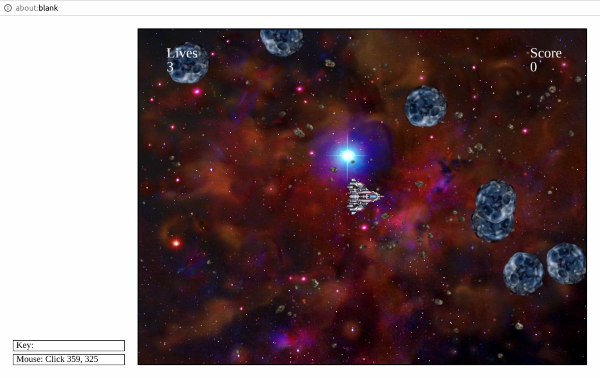

# PythonAsteroids
Remake of the Classic arcade game "Asteroids" built in Python

## Screenshot

## Technologies Used
- Python 2.6

## Built With
- SublimeText 3
- codeskulptor.org

## Author
John-Mike Marquardt

## Acknowledgements
* sound assets purchased from sounddogs.com, please do not redistribute
* art assets created by Kim Lathrop, may be freely re-used in non-commercial projects
* Rice University Intro to Programming in Python, Coursera
* codeskulptor.org (copy and paste pong.py into codeskulptor.org gui to run)

## Future Improvements
- Import appropriate libraries to run in console
- Use Django to run in Browser
